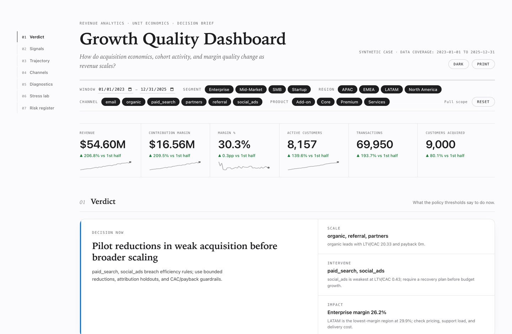
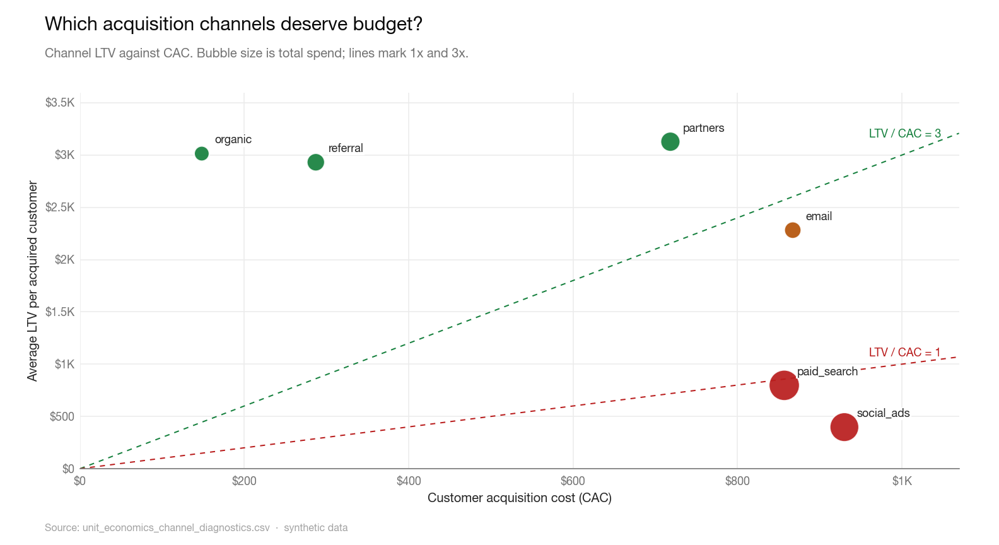

# Revenue Analytics & Unit Economics

[](https://github.com/mfidalgomartins/revenue-unit-economics-system/actions/workflows/ci.yml)
[](pyproject.toml)
[](LICENSE)
[](https://www.python.org/)

**One question drives the whole system: is growth sustainable, or just expensive?**

Top-line revenue growth can hide weak acquisition efficiency, low activation, declining retained activity, or margin erosion. The system combines channel LTV/CAC and empirical payback, cohort activation and retention, randomized marketing lift, observed price elasticity, descriptive multi-touch attribution, and bounded decision scenarios. It publishes tested dbt marts, an interactive dashboard, an authenticated aggregate API, a chart pack, and an analytical PDF.

> **Synthetic case study.** All analytical values and tables derive from a fixed synthetic seed. The results do not describe a real company or forecast a real market.

**→ [Open the live dashboard](https://mfidalgomartins.github.io/revenue-unit-economics-system/)**  
**→ [Read the full report (PDF)](https://mfidalgomartins.github.io/revenue-unit-economics-system/outputs/reports/revenue_unit_economics_report.pdf)**  
Light and dark mode. No login or install required. Works on mobile.

**Case result.** Paid search and social ads absorb 68% of acquisition spend while both return less than 1× CAC. Under the case assumptions, a budget-neutral reallocation increases modeled contribution by $7.9M (48%), with a $2.2M downside-case uplift. These are observed-window scenario results, not annual forecasts.

<picture>
  <source media="(prefers-color-scheme: dark)" srcset="docs/images/dashboard-dark.jpg">
  
</picture>

---

## What it diagnoses

| Question | Method |
|----------|--------|
| Which acquisition channels deserve budget? | LTV/CAC ratio and observed payback status per channel, classified against explicit scale guardrails |
| Is margin holding as revenue scales? | Monthly contribution margin trend with margin-rate tracking |
| Where do cohorts lose activity? | Month-0 activation, signup activity, retained-from-month-0 activity, and revenue retention through month 24 |
| Where is margin being diluted? | Contribution margin breakdown by segment, region, and product |
| What does the reallocation envelope look like? | Bounded scenario engine: best / base / worst case under CAC and LTV elasticities |
| Which marketing activity is incremental? | Randomized customer holdouts with CUPED-adjusted contribution lift and 95% confidence intervals |
| How does demand respond to price? | Randomized weekly price interventions with fixed effects and week-clustered log-log elasticity |
| How should observed value be allocated across touches? | Fully reconciling position-based attribution, explicitly separated from causal lift |



## Run

```bash
make setup    # create venv, install dependencies, and install Chromium
make qa       # run the full pipeline and test suite
make warehouse # build and test incremental dbt models
make orchestrate # run with persisted stage attempts, retries, SLAs, and alerts
```

Without `make`:

```bash
python3.12 -m venv .venv && source .venv/bin/activate
pip install -r requirements-dev.txt
python -m playwright install chromium
python -m src.run_pipeline && pytest
```

Python 3.12. The deterministic case requires no external services or credentials. Real-source ingestion and the authenticated API are opt-in deployment paths.

External data uses the same downstream graph without invoking the synthetic generator:

```bash
make ingest
PIPELINE_PROFILE=external RAW_DATA_DIR=data/staging make orchestrate
```

For PostgreSQL, load the verified bundle transactionally with `make load-postgres`, then run the external profile with `DBT_TARGET=prod`. See the [ingestion contract](docs/INGESTION.md) for required variables and ordering.

## Quality gates

The core CI gates are available locally:

```bash
make lint     # ruff lint
make fmt-check # ruff formatting check
make type     # mypy type-check
make deps     # installed dependency consistency
make audit    # pip-audit dependency scan
make test     # pytest with branch coverage on covered modules (fails under 90%)
make qa       # all of the above plus a full pipeline run
```

Lint, types, dependency audit, branch coverage, CodeQL static analysis, and
Dependabot updates are configured in [`pyproject.toml`](pyproject.toml) and
[`.github/`](.github/). See [CONTRIBUTING.md](CONTRIBUTING.md) for the
development loop and [SECURITY.md](SECURITY.md) for the security policy.
The percentage gate covers the analytical and contract code listed in the
coverage configuration; publication renderers run end to end in CI but are not
included in that percentage.

## Data scope

The fixed baseline seed generates 9,000 customers, 69,950 transactions, 22,465 privacy-minimal marketing touchpoints, 3,000 randomized marketing-experiment observations, 1,680 randomized weekly pricing cells, and daily marketing spend for six acquisition channels from January 1, 2023 through December 31, 2025. Customers span four segments and four regions; the pipeline regenerates the complete case from the seed.

## Pipeline

```
synthetic generation or complete six-table source ingestion → atomic publication →
contract validation →
incremental dbt warehouse → features + causal measurement →
analysis + scenarios → charts + static/API-backed dashboard →
reports + lineage + SLAs → QA gate
```

Each stage writes governed outputs under `outputs/` and `data/processed/`. The metric registry (`src/governance/metric_registry.py`) centralizes the payback horizon, unit-economics classification thresholds, margin floor, and risk defaults. Formula parity and final QA checks detect drift across pandas, SQL, dashboard, and published outputs.

For the complete design, see [architecture](docs/ARCHITECTURE.md), [real-source ingestion](docs/INGESTION.md), [causal methods](docs/CAUSAL_METHODS.md), [API operations](docs/API.md), [privacy controls](docs/PRIVACY.md), and the [operations runbook](docs/OPERATIONS.md).

## Metric contracts

| Metric | Definition |
|--------|------------|
| Contribution margin | Revenue minus direct delivery cost |
| Observed LTV | Mean cumulative contribution margin per acquired customer, including customers with zero transactions |
| CAC | Full-window channel spend divided by customers acquired through that channel |
| Payback period | For customers observed through 24 acquisition-age months, including zero-transaction customers: first month cumulative contribution per mature customer reaches CAC computed from spend in that mature subset's acquisition-date window. `>24m` is right-censored; no mature customers means insufficient maturity |
| Month-0 activation | Customers active in their signup month divided by the full signup cohort |
| Signup activity | Customers active in month *n* divided by the full signup cohort; mature inactive months remain explicit zeros |
| Retained activity | Month-*n* customers who were active in month 0 divided by month-0 active customers |
| Scenario uplift | Modeled contribution change under bounded reallocation and explicit CAC/LTV response assumptions. Baseline budget is a ceiling; allocated spend and any holdback are reported. The canonical case is budget-neutral and is not an annual forecast |
| Marketing incrementality | CUPED-adjusted treatment-minus-control contribution per treated customer from randomized holdouts, with a 95% confidence interval |
| Price elasticity | Percent demand response to a 1% price change, identified from randomized weekly price assignments inside the observed 0.90–1.10 price index |
| Multi-touch attribution | Position-based allocation of observed contribution across pre-signup touches; reconciles to total contribution but does not estimate causal lift |

## Layout

```
src/          pipeline stages, one package per stage; shared design tokens and paths
data/         synthetic raw inputs and processed customer-level feature tables
sql/          reference SQL for the core feature tables, parity-tested with DuckDB
warehouse/    dbt project with DuckDB development and Postgres production profiles
config/       versioned operational SLA policy
ops/          deployable UTC schedule
outputs/      analytical tables, graphs, reports, and the dashboard
docs/         architecture, ingestion, API, privacy, causal, and operations guides
tests/        unit, contract, parity, and stage-integration tests
```

## Key outputs

| Output | Description |
|--------|-------------|
| [`outputs/dashboard/growth-quality-dashboard.html`](outputs/dashboard/growth-quality-dashboard.html) | Self-contained synthetic snapshot for static hosting; the same unchanged visual surface uses authenticated, privacy-thresholded server aggregates when served by FastAPI |
| [`outputs/charts/`](outputs/charts/) | Nineteen generated PNGs, one per analytical question, covering trend, composition, ranking, distribution, cohort, concentration, and scenario views |
| [`outputs/reports/revenue_unit_economics_report.pdf`](outputs/reports/revenue_unit_economics_report.pdf) | Tagged analytical PDF with inline charts, navigation, methodology, risks, evidence limits, and prioritized case recommendations |
| [`outputs/reports/qa_report.md`](outputs/reports/qa_report.md) | Analytical consistency gate covering data reconciliation, calculations, scenario invariants, output presence, and reproducibility checks |
| [`outputs/tables/marketing_incrementality.csv`](outputs/tables/marketing_incrementality.csv) | Randomized channel lift, uncertainty, and experiment evidence volume |
| [`outputs/tables/pricing_elasticity.csv`](outputs/tables/pricing_elasticity.csv) | Global and product price elasticities with week-clustered intervals, diagnostics, and validity range |
| [`outputs/governance/lineage.json`](outputs/governance/lineage.json) | Deterministic dbt node-edge lineage derived from the build manifest |
| [`config/operational_slas.json`](config/operational_slas.json) | Versioned freshness, availability, latency, schedule, and privacy objectives |

## Methodology

- Acquisition economics use full-window channel spend and all acquired customers, including customers with no transactions.
- Payback uses 24-month mature acquisition cohorts, aligns CAC to their acquisition-date window, includes mature zero-transaction customers, and distinguishes right-censored non-recovery from insufficient maturity or missing aligned spend.
- Cohort analysis separates month-0 activation, signup activity, retained-from-month-0 activity, and month-0-indexed revenue retention; mature inactive months remain explicit zeros.
- Scenario analysis reallocates spend using explicit CAC and LTV elasticities, channel-efficiency thresholds, and scale-up caps.
- Five deterministic seeds test whether the scenario direction is stable under the same synthetic data-generating process.
- Randomized marketing holdouts estimate incremental contribution separately from descriptive attribution.
- Randomized weekly pricing cells estimate elasticity with region and week fixed effects; pricing decisions remain inside the tested range.
- Position-based attribution reconciles customer contribution across touches but is never used as a causal effect.
- dbt incrementally rebuilds transaction and spend facts with a 30-day late-arrival window and tests keys, relationships, and marts.

## Limitations

- Data is synthetic. The pipeline demonstrates analytical method, not a real market.
- LTV is observed contribution margin per customer over the available window, not a forward forecast.
- CAC is period-level spend divided by customers acquired in the channel; position-based attribution is published separately and does not redefine CAC.
- Cohort and payback estimates are limited by the maturity available inside the observed window.
- Scenario outputs apply bounded CAC/LTV elasticities and cap channel-level scale-up at 100%; excess budget is held back when capacity is exhausted.
- Seed sensitivity repeats the same synthetic data-generating process; it tests stability, not external validity.
- Revenue and cost are intentionally right-skewed. A small share of transactions has negative contribution margin to exercise cost-to-serve exception handling.
- Synthetic randomized assignments demonstrate correct estimators; they do not establish external validity for a real business.
- The included API limiter is process-local. Multi-replica deployment should place rate limiting at the gateway or a shared store.

## Roadmap

- **Tombstone contract for source deletions.** Incremental ingestion currently treats a record's absence from a delta response as "not yet seen," not "deleted"; a signed deletion contract from each source is needed before hard deletes can be trusted downstream.
- **Gateway-level rate limiting.** The API's request limiter is process-local (see [Limitations](#limitations)); a multi-replica deployment should move it to the gateway or a shared store before scaling past one instance.
- **Real-source elasticity and incrementality.** Price elasticity and marketing-lift estimators are validated against synthetic randomized assignments; the next production milestone is running them against a live experiment platform and holding out real budget.

## Stack

Python 3.12 · pandas · NumPy · matplotlib · FastAPI · Pydantic · HTTPX · dbt Core · DuckDB · PostgreSQL · Playwright · vanilla JS/SVG · ruff · mypy · pytest + coverage · pip-audit · GitHub Actions

## License

MIT — see [LICENSE](LICENSE).
