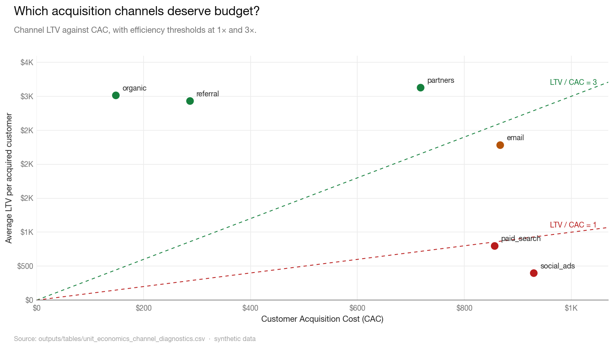

# Revenue Analytics & Unit Economics

[](https://github.com/mfidalgomartins/revenue-unit-economics-system/actions/workflows/ci.yml)
[](LICENSE)
[](https://www.python.org/)

**One question drives the whole system: is growth sustainable, or just expensive?**

Top-line revenue growth can hide weak acquisition efficiency, fragile retention, or margin erosion. This pipeline takes synthetic but realistic commercial data and produces governed unit economics — LTV/CAC by channel, cohort retention curves, contribution margin by segment, and a scenario engine for spend reallocation — then surfaces everything in an interactive hosted dashboard.

**→ [Open the live dashboard](https://mfidalgomartins.github.io/revenue-unit-economics-system/)**  
Light and dark mode. No login or install required. Works on mobile.



---

## What it diagnoses

| Question | Method |
|----------|--------|
| Which acquisition channels deserve budget? | LTV/CAC ratio and payback period per channel, colour-coded against the 3:1 scale threshold |
| Is margin holding as revenue scales? | Monthly contribution margin trend with margin-rate tracking |
| Which cohorts decay fastest? | Revenue and activity retention curves from signup to month 24 |
| Where is margin being diluted? | Contribution margin breakdown by segment, region, and product |
| What does the reallocation envelope look like? | Bounded scenario engine: best / base / worst case under CAC and LTV elasticities |

## Run

```bash
make setup    # create venv and install dev dependencies
make qa       # run the full pipeline and test suite
```

Without `make`:

```bash
python3 -m venv .venv && source .venv/bin/activate
pip install -r requirements-dev.txt
python src/run_pipeline.py && pytest -q
```

Python 3.12. No external services or credentials required.

## Pipeline

```
data generation → validation → profiling → feature engineering →
core analysis → scenario engine → visualizations + dashboard →
QA gate (32 checks) → governance artifacts
```

Each stage writes deterministic outputs under `outputs/` and `data/processed/`. A central metric registry (`src/governance/metric_registry.py`) defines LTV, CAC, payback, and efficiency thresholds in one place — analysis, dashboard, and validation all read from it.

## Layout

```
src/          pipeline stages, one package per stage
data/         raw and processed CSVs (raw generated from a fixed seed)
sql/          reference SQL for the core feature tables
outputs/      charts, tables, reports, and the dashboard
tests/        unit tests, metric contract tests, dashboard payload tests
```

## Key outputs

| Output | Description |
|--------|-------------|
| [`outputs/dashboard/growth-quality-dashboard.html`](outputs/dashboard/growth-quality-dashboard.html) | Self-contained interactive dashboard — filters, tooltips, light/dark mode, embedded data |
| [`outputs/Graphs/`](outputs/Graphs/) | Six publication-ready PNGs, one per executive question |
| [`outputs/reports/decision_brief.md`](outputs/reports/decision_brief.md) | Executive summary with recommendations and the scenario envelope |
| [`outputs/reports/metric_governance_registry.md`](outputs/reports/metric_governance_registry.md) | Metric definitions and thresholds in human-readable form |
| [`outputs/reports/pre_delivery_validation_report.md`](outputs/reports/pre_delivery_validation_report.md) | QA gate output — 32 checks run before publishing |

## Limitations

- Data is synthetic. The pipeline demonstrates analytical method, not a real market.
- LTV is observed contribution margin per customer over the available window, not a forward forecast.
- CAC is period-level spend divided by customers acquired in the channel; no multi-touch attribution.
- Scenario outputs apply bounded CAC/LTV elasticities under spend changes; they are policy simulations, not predictions.

## Stack

Python 3.12 · pandas · NumPy · matplotlib · vanilla JS/SVG for the dashboard · GitHub Actions for CI and tagged releases

## License

MIT — see [LICENSE](LICENSE).
