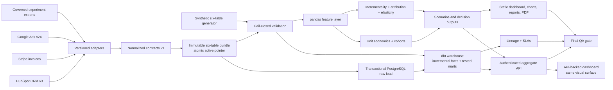

# Architecture

The repository implements two compatible operating modes:

- a deterministic synthetic case that rebuilds every committed analytical artifact without credentials;
- a production ingestion and serving path with versioned vendor adapters, incremental dbt models, persisted orchestration state, and an authenticated aggregate API.

Both modes converge on the same normalized commercial contracts and governed metric definitions.

## System flow

`src/run_pipeline.py` and `src/operations/orchestrator.py` consume the same validated graph. The synthetic profile has fifteen stages; the external profile skips generation and starts from an explicit normalized source directory. The orchestrator adds attempt persistence, bounded retries, stage SLAs, and structured alerts.

## Stage contracts

| Stage | Module | Durable output |
|---|---|---|
| synthetic generation | `src/data_generation/` | six `data/raw/*.csv` tables |
| real-source ingestion | `src/ingestion/` | immutable six-table bundle, active pointer, manifest, and optional PostgreSQL raw schema |
| raw validation | `src/validation/validate_raw_data.py` | contract-gate evidence |
| warehouse | `src/warehouse/`, `warehouse/` | tested DuckDB/Postgres models and dbt lineage |
| feature engineering | `src/feature_engineering/` | customer, cohort, and unit-economics tables |
| core analysis | `src/analysis/` | monthly, cohort, dimensional, and channel diagnostics |
| causal measurement | `src/causal/` | incrementality, attribution, elasticity, and pricing decisions |
| scenario engine | `src/scenario_engine/` | bounded allocation, stress, and seed-sensitivity outputs |
| operational governance | `src/operations/` | deterministic pipeline lineage and SLA catalog |
| publications | dashboard, visualization, governance packages | HTML, PNG, Markdown, CSV, and PDF artifacts |
| final QA | `src/validation/validate_final_outputs.py` | machine-readable checks, issues, and report |

## Source boundary

`src/ingestion/contracts.py` defines contract version `1.0.0` for all six pipeline inputs. Publication requires the complete bundle, exact columns, non-empty initial tables, unique keys, allowed domains, finite economics, non-negative counts/prices/revenue/spend, and cross-source customer integrity. Contribution outcomes and margins remain signed because losses are valid observations.

The adapters minimize data before persistence:

- CRM: pseudonymous ID, signup date, segment, region, channel;
- billing: invoice ID, governed CRM ID, paid date, revenue, direct cost, product;
- advertising: date, mapped channel, spend;
- governed exports: pseudonymous touchpoint, holdout, and pricing-cell fields required by the estimators.

Incremental deltas merge by contract key with prior normalized data. A SHA-256 manifest records rows, source system, source API version, extraction time, and published file digest. Each content-addressed snapshot is immutable; merge and atomic pointer activation hold an exclusive directory lock. Vendor payloads and secrets are not written.

## Warehouse

The dbt project supports DuckDB development/CI and PostgreSQL production profiles. The production loader verifies the active bundle, copies all six inputs to candidate tables, validates row counts, and replaces stable raw-table contents in one advisory-locked transaction. `fct_transactions` and `fct_marketing_spend` use idempotent `delete+insert` incremental materialization with a 30-day correction window. `dim_customers` rebuilds from the current normalized snapshot. Tested marts provide monthly performance and channel unit economics.

The dbt manifest is reduced to a deterministic node-edge graph. Volatile invocation metadata, compiled SQL, and runtime paths are excluded from the published lineage artifact.

Python remains responsible for the richer empirical payback, completed cohort grids, randomized estimators, reports, and visual publication. Final QA reconciles warehouse counts and core channel metrics to the Python outputs; SQL/Python parity is a gate, not an informal expectation.

## Analytical claim boundaries

The metric registry governs LTV/CAC, empirical payback, margin thresholds, and risk rules. Three acquisition measures remain distinct:

1. period CAC and observed contribution LTV describe channel economics;
2. randomized customer holdouts identify marketing incrementality;
3. position-based multi-touch attribution allocates observed contribution but is non-causal.

Price elasticity is identified from randomized product-region-week assignments. Fixed effects absorb stable product, region, and seasonal differences; finite-sample-corrected CR1 standard errors cluster assignment cells by week. The output publishes cluster count, residual degrees of freedom, HC1 sensitivity, and design-matrix condition number. Pricing recommendations remain inside the experimental support.

Randomized marketing outputs publish sample-ratio-mismatch and pre-period balance diagnostics. A failed diagnostic marks the estimate for review instead of silently presenting it as decision-ready.

## Dashboard and API

The dashboard template has one visual implementation and two data modes:

- static mode embeds deterministic synthetic columnar records for public GitHub Pages;
- API mode embeds only safe configuration, sends filters to `/v1/dashboard/snapshot`, and renders server-side aggregates.

The API uses one repository interface for read-only DuckDB or PostgreSQL queries, applies governed domain filters, suppresses slices and rows below 10 customers, and returns only aggregate series, tables, cohort summaries, and quantile bins. Causal arms and pricing models must also meet the same publication threshold. Full-coverage channel economics are omitted from date, segment, region, or product slices where they would otherwise be mistaken for filtered metrics. Generated unit-economics and causal products pass schema checks and use a file-signature-aware cache. The API does not return customer, transaction, touchpoint, invoice, or campaign identifiers.

Programmatic clients use SHA-256-configured API keys and explicit scopes. Browser access uses same-origin Basic authentication. Responses are non-cacheable and include correlation, content, framing, referrer, permissions, and CSP controls. The process-local rate limiter is a final defense for single-process use; multi-replica deployments enforce shared limits at the gateway.

## Operations

`src/operations/pipeline_spec.py` is the canonical dependency, retry, and stage-SLA graph. Runtime attempts are stored transactionally in SQLite with run ID, stage, attempt, timing, status, and error type. Analytical rows, credentials, and exception messages are excluded.

Alerts always emit canonical JSON to standard output. Optional HTTPS webhook delivery is HMAC-SHA-256 signed and uses bounded retries. Sink failures are isolated and cannot mask the recorded pipeline result. `config/operational_slas.json` governs schedule, completion, freshness, API availability/latency, and privacy thresholds. The deployable UTC schedule calls a wrapper that rejects overlapping runs with `flock`.

Runtime state is deliberately ignored:

| Path | Lifecycle |
|---|---|
| `data/raw/`, `data/processed/`, publication outputs | deterministic case artifacts |
| `data/staging/` | environment-specific normalized source state |
| `outputs/duckdb/` | local dbt database; production uses PostgreSQL |
| `outputs/operations/` | mutable run history |
| `outputs/governance/` | deterministic lineage and SLA artifacts |

## Determinism

- Synthetic sources use isolated NumPy generators and a fixed default seed.
- Alternate seed evaluation remains in memory and cannot overwrite canonical raw, processed, or scenario files.
- CSV, Markdown, HTML, lineage, SLA, chart, and PDF publication is stable for fixed code, inputs, runtime, and dependency lock.
- The PDF blocks network access, renders in memory, normalizes metadata, and publishes semantic tags, bookmarks, and language metadata.
- dbt runtime logs, DuckDB storage bytes, run timestamps, and SQLite operational history are mutable runtime state and are excluded from artifact byte-comparison claims.

## Quality strategy

The enforced gate covers:

- raw schema, grain, types, ranges, domains, dates, and referential integrity;
- dbt model and relationship tests plus warehouse/Python parity;
- unit economics, cohort denominators, empirical payback, scenario budgets, and seed immutability;
- randomized estimator intervals, attribution reconciliation, negative elasticity, and bounded pricing recommendations;
- authenticated API scope failures, privacy suppression, safe bootstrap data, and security headers;
- orchestrator state, retries, SLA alerts, HMAC delivery, lineage, and SLA contracts;
- chart manifest, dashboard semantics, PDF structure, metadata, and published documentation;
- ruff, mypy, exact dependency integrity, vulnerability audit, CodeQL, pytest, and branch coverage of at least 90%.

Chart and PDF renderers are exercised end to end and checked semantically but omitted from percentage coverage because their stable contract is the rendered artifact rather than internal branch structure.

## Deployment boundaries

Repository code cannot configure infrastructure policy. A production deployment still supplies and governs:

- secret-manager values and rotation;
- TLS termination, network policy, and shared gateway rate limiting;
- PostgreSQL sizing, backups, recovery, and least-privilege roles;
- log aggregation, alert routing, dashboard SLO monitoring, and incident ownership;
- privacy retention, deletion, access review, lawful basis, and jurisdiction-specific controls;
- experiment power, exposure integrity, interference, and business approval.

These are deployment controls around an implemented application path, not missing analytical components.
